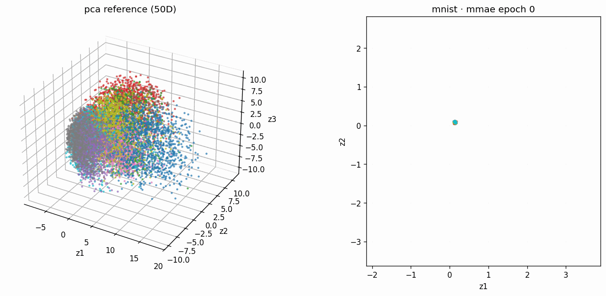
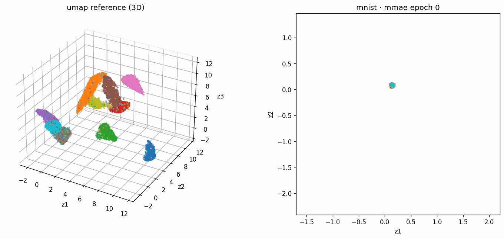
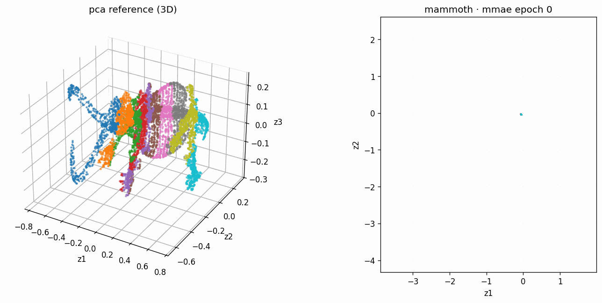

# Manifold-Matching Autoencoders

Train an autoencoder whose latent space preserves the **pairwise distance
structure** of a reference embedding (PCA, UMAP, or t-SNE) of the input data.

The whole regularizer fits in ten lines:

```python
def manifold_matching_loss(z, ref):
    z_dist = torch.cdist(z, z)
    r_dist = torch.cdist(ref, ref)
    z_norm = (z_dist - z_dist.mean()) / (z_dist.std() + 1e-8)
    r_norm = (r_dist - r_dist.mean()) / (r_dist.std() + 1e-8)
    return ((z_norm - r_norm) ** 2).mean()

# Total loss = MSE reconstruction + λ * manifold_matching_loss(z, reference)
```

The reference is computed once on the training set; each sample carries its
reference coordinates through the dataloader, and the regularizer matches
batches of latent codes to batches of reference codes.

---

## What it looks like

The latent space evolving each epoch alongside the reference embedding it's
trying to match (left = reference, right = latent).

**MNIST · MMAE · 50-D PCA reference**



**MNIST · MMAE · 3-D UMAP reference**



**Mammoth · MMAE · 3-D PCA reference**



---

## Install

```bash
pip install -r requirements.txt
```

That's it. Datasets are auto-downloaded on first use into `./data_cache/`.

---

## Quick start

```bash
# MMAE with PCA reference (defaults: ref_dim=2, lambda=1.0)
python train.py --dataset mnist --epochs 50

# Vanilla autoencoder baseline (regularizer disabled)
python train.py --dataset mnist --regularizer none --epochs 50

# MMAE with 2D UMAP reference
python train.py --dataset mnist --reference umap --ref_dim 2

# MMAE with 2D t-SNE reference
python train.py --dataset spheres --reference tsne --ref_dim 2

# Render a GIF of the latent space evolving each epoch
python train.py --dataset mammoth --epochs 80 --gif --snapshot_every 1
```

Each run writes to `results/<dataset>_<regularizer>[_<reference><ref_dim>...]/`
with `latent.png`, `history.json`, and (if `--gif`) `latent_evolution.gif`.

---

## Datasets

| Name      | Source                                  | Shape           | Notes                    |
| --------- | --------------------------------------- | --------------- | ------------------------ |
| `mnist`   | torchvision (auto-downloads)            | 784             | Full 60k train; cap with `--n_samples N` |
| `fmnist`  | torchvision (auto-downloads)            | 784             | Full 60k train; cap with `--n_samples N` |
| `spheres` | synthetic (TopoAE-style nested spheres) | 101             | 11 spheres in 100+1 dims |
| `mammoth` | Smithsonian 3D scan (auto-downloads)    | 3               | ~1M pts; default subsample 50k (use `--n_samples 0` for full set) |

---

## Design choices that matter

The defaults below aren't arbitrary — each one is what made the latent space
actually resemble the reference in our experiments. If you change one, you
likely need to retune the others.

### 1. Tanh decoder + data scaled to `[-1, 1]`

The `MLPDecoder` ends with `nn.Tanh()`, and every bundled loader normalizes
features to `[-1, 1]` (using each dataset's training-set min/max). This is
deliberate:

- The decoder's output range is bounded, so the encoder cannot hide
  information in the *magnitude* of the latent — it's forced to encode
  spatial structure, which is exactly what the manifold-matching regularizer
  can sculpt.
- Reconstruction loss stays in the same scale as the (z-scored)
  manifold-matching loss, so `λ = 1.0` is a balanced default rather than a
  wildly unbalanced one.

If you bring your own data and it's already z-scored or otherwise unbounded,
pass `--output_activation none`.

### 2. BatchNorm between hidden layers (only)

Each hidden block is `Linear → BatchNorm1d → ReLU`. **BN is never applied to
the bottleneck output (the latent code) or to the reconstruction output** —
either would distort the geometry that the regularizer is trying to shape, or
the reconstruction loss the decoder is trying to minimize.

Disable with `--batchnorm off` if you want a fairer comparison against
non-BN baselines.

### 3. Best-model checkpointing on validation total loss

By default `train_run` tracks the validation total loss every epoch, keeps a
CPU copy of the best state seen, and reloads it after the final epoch. The
returned `result.model` is therefore the best model encountered during
training, not the last-epoch model. `result.best_epoch` records which epoch
won.

This catches late-stage drift, especially when running long with the
manifold-matching term — pretty common for the latent's geometry to crystallize
mid-training and then drift later.

Disable with `--no_checkpoint` if you specifically want the final-epoch
weights.

### 4. Reference: shape vs. scale (`--mm_normalize`)

The default loss z-scores both pairwise distance matrices before matching
them, making the latent's *shape* match the reference but leaving its scale
free. Pass `--mm_normalize none` to anchor the latent to the same metric scale
as the reference (raw Euclidean distance matching). Raw mode usually wants a
smaller `--lam` since the loss magnitude is in squared-distance units.

### 5. Reference embedding: PCA, UMAP, or t-SNE

| Method | When it makes sense                                                 | Speed                |
| ------ | ------------------------------------------------------------------- | -------------------- |
| `pca`  | Default. Fast, deterministic, has out-of-sample `transform`         | < 1 s on MNIST 60k   |
| `umap` | Already-clustered 2D/3D targets; gives the cleanest visual results  | ~2-3 min on MNIST 60k|
| `tsne` | When you specifically want a t-SNE-shaped latent                    | ~10-15 min on MNIST 60k |

PCA is the default because it's free. For visually clean clustering on
MNIST/FMNIST, UMAP as the reference tends to produce the nicest latents — try
`--reference umap` once you have time to sit through the UMAP fit.

The reference dimension is `--ref_dim N` (default 2). The reference can be
higher-dim than the latent — e.g. PCA-50 → 2D latent matches the *distance
structure* in 50 dims into 2 dims via the regularizer, which often works
better than PCA-2 → 2D latent because 50-D PCA preserves more global structure.

### 6. Validation-time visualization

The final plot and the GIF use a side-by-side layout: static reference on
the left, evolving latent on the right (auto-detects 2D vs 3D for each panel
independently). Disable with `--no_compare` for a single-panel plot.

---

## Try it from a notebook (Colab-friendly)

Open `examples/colab_quickstart.ipynb`. It clones the repo, installs deps,
trains MMAE on MNIST or Mammoth, and renders the per-epoch latent-space GIF
inline.

---

## Use it as a library

```python
from mmae import train_run
from mmae.viz import plot_latents, make_latent_gif

result = train_run(
    dataset="mnist", regularizer="mmae", reference="pca", ref_dim=50,
    latent_dim=2, epochs=30, snapshot_every=1,
)

# Side-by-side reference vs. trained latent
plot_latents(
    result.snapshots[-1][1], result.snapshots[-1][2],
    reference=result.ref_test, reference_y=result.bundle.y_test,
    save_path="latent.png",
)

# Animated GIF
make_latent_gif(
    result.snapshots, save_path="latent.gif",
    reference=result.ref_test, reference_y=result.bundle.y_test, fps=8,
)
```

---

## What's in the box

```
manifold-matching-autoencoders/
├── train.py                        # CLI entrypoint
├── requirements.txt
├── README.md
├── assets/                         # GIFs/screenshots used in this README
├── examples/
│   └── colab_quickstart.ipynb      # one-click Colab demo with GIF
└── mmae/
    ├── __init__.py
    ├── model.py                    # MLPEncoder, MLPDecoder, Autoencoder
    ├── reference.py                # PCA / UMAP / t-SNE reference computation
    ├── data.py                     # mnist, fmnist, spheres, mammoth
    ├── train.py                    # training loop + best-model checkpointing
    └── viz.py                      # 2D/3D scatter + per-epoch GIF
```

---

## Citation

If you use this code please cite the paper:

> Cheret, L., Létourneau, V., Nejadgholi, I., Drummond, C., Al Osman, H., &
> Fraser, M. (2026). *Manifold-Matching Autoencoders*. arXiv:2603.16568.
